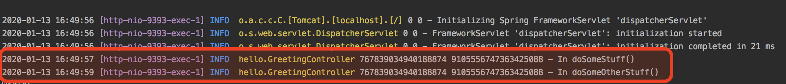

## SpringBootFdlty

### 1. Clone the repository
`https://github.com/ptabasso2/SpringTestFdlty.git`

### 2. Build the project
`./gradlew build`

***1. Datadog Format: Running the app and viewing the ids injected in the logs***

Changing code to use DD Format 

Viewing in the logs 

Header names 

***2. B3 Format: Running the app and viewing the ids injected in the logs***

Changing code to use B3 Format 

Viewing in the logs 

Header names 

### 3. Run the application when using manual tracing
`java -jar build/libs/springtestfdlty-1.0.jar --server.port=9393`

### 4. Test the application
`curl localhost:9393/ServiceC`

*This will return the string **ServiceD***

### 5. Now use the java agent

***1. Make sure the DD Agent is deployed, configured to accept APM traces and started***

[DD Agent Configuration](https://docs.datadoghq.com/tracing/send_traces/)

***2. Instrument the application using the java agent (dd-java-agent.jar) which uses Datadog headers***

`java -javaagent:./dd-java-agent.jar -Ddd.agent.host=<host where the DD agent runs> -Ddd.agent.port=8126 -Ddd.trace.methods=hello.GreetingController[doSomeStuff,doSomeOtherStuff] -Ddd.service.name=SpringBootFdlty -jar springtestfdlty-1.0.jar --server.port=9393`

***3. Instrument the application using the java agent (dd-java-agent.jar) and using B3 Headers***

Here we use  `-Ddd.propagation.style.inject=B3` `-Ddd.propagation.style.extract=B3`   
`java -javaagent:./dd-java-agent.jar -Ddd.propagation.style.inject=B3 -Ddd.propagation.style.extract=B3 -Ddd.agent.host=<host where the DD agent runs> -Ddd.agent.port=8126 -Ddd.trace.methods=hello.GreetingController[doSomeStuff,doSomeOtherStuff] -Ddd.service.name=SpringBootFdlty -jar springtestfdlty-1.0.jar --server.port=9393`  
For more details https://docs.datadoghq.com/tracing/setup/java/

